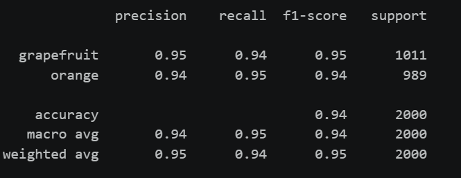
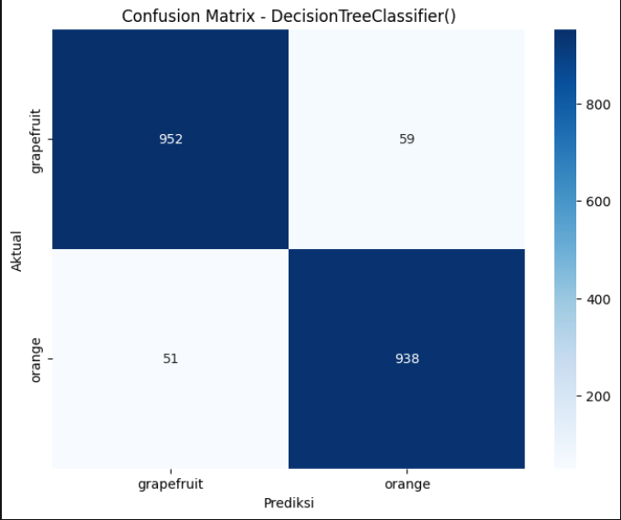
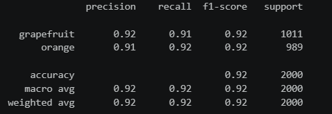
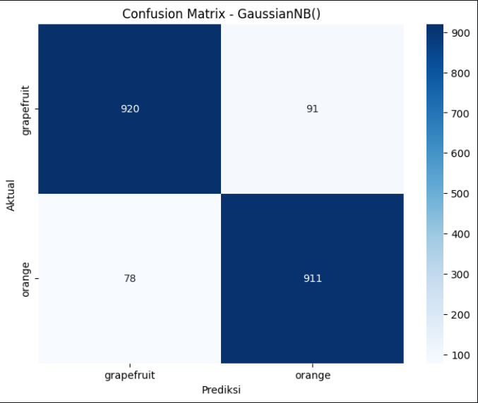
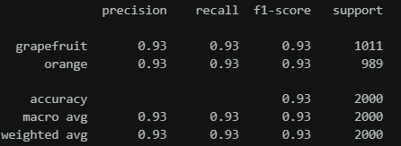
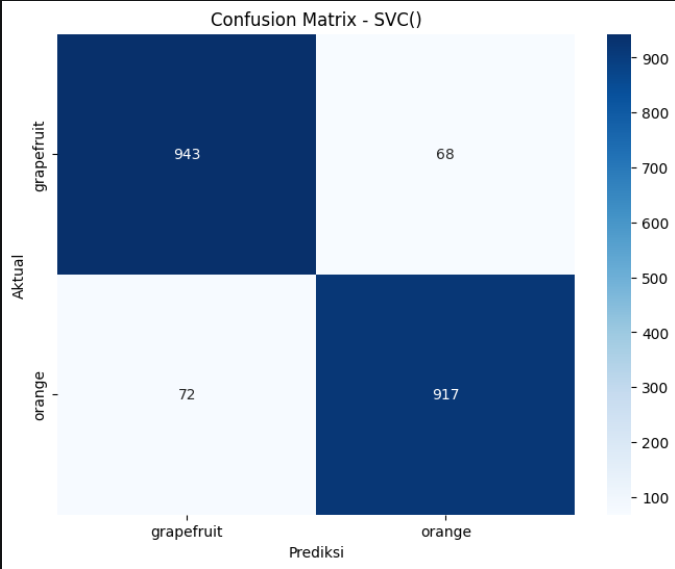

## UTS Machine Learning

  

## Data Collecting
Dataset yang digunakan dalam proyek diperoleh dari platform Kaggle

Dataset terdiri dari beberapa fitur yaitu:
- diameter → ukuran diameter buah
- weight → berat buah
- red → intensitas warna merah
- green → intensitas warna hijau
- blue → intensitas warna biru
- name → label kelas (orange / grapefruit)

## Exploratory Data Analysis (EDA)
**Pada tahap ini dilakukan visualisasi untuk memahami karakteristik data dengan melakukan :** 
- Visualisasi boxplot untuk melihat apakah terdapat outlier atau tidak
- Visualisasi histogram untuk melihat sebaran data terhadap label atau target

**Hasil yang diperoleh**
- Berdasarkan visualisasi boxplot, terdapat beberapa outlier atau nilai yang keluarr dari whisker pada fitur diameter, red, green, dan blue. Fitur blue menunjukan adanya outlier extrem sehingga distribusi datanya tidak merata. sedangkan untuk fitur diameter hanya memiliki sedikit outlier sehingga masih dalam batas wajar dan fitur weight tidak memiliki outlier.
- Fitur weight dan diameter memiliki distribusi yang paling jelas dalam membedakan kelas, sedangkan fitur red dan green memiliki overlap sedang. Fitur blue memiliki overlap tinggi dan distribusi miring ke kanan

## Preprocessing
- Encoding Label : Merubah data label (kolom name) menjadi numerik dengan menggunakan label encoder
- Splitting data : Membagi dataset menjadi data latihan 80% (8000 data) dan data test 20% (2000 data)
- Scalling : Melakukan standardisasi pada semua fitur numerik
- Tidak dilakukan proses penghapusan outlier dikarenakan dalam batas wajar dan merepresentasikan data alami

## Modelling & Evaluasi Model
<h2>Decision Tree</h2>

  
  

**Precission (Ketepatan)**
- Dari seluruh buah yang diprediksi sebagai grapefruit oleh model, sebanyak 95% merupakan prediksi yang benar (grapefruit), sedangkan sekitar 5% sebenarnya merupakan orange tetapi salah diprediksi sebagai grapefruit
- Dari seluruh buah yang diprediksi sebagai orange oleh model, sebanyak 94% merupakan prediksi yang benar (orange), sedangkan sekitar 4% sebenarnya merupakan grapefruit tetapi salah diprediksi sebagai orange

**Recall (Keberhasilan Menangkap)**
- Dari seluruh data grapefruit yang seharusnya ada yaitu sebanyak 1011 data, model berhasil mengidentifikasi sekitar 94% atau ±950 data sebagai grapefruit. Sementara itu, sekitar 6% atau ±61 data tidak berhasil dikenali sebagai grapefruit dan salah diklasifikasikan sebagai orange.
- Dari seluruh data orange yang seharusnya ada yaitu sebanyak 989 data, model berhasil mengidentifikasi sekitar 95% atau ±939 data sebagai orange. Sementara itu, sekitar 5% atau ±50 data tidak berhasil dikenali sebagai orange dan salah diklasifikasikan sebagai grapefruit.

**F1-Score**
Nilai f1-score yang diperoleh untuk kedua kelas berada di kisaran 0.94–0.95, yang menunjukkan bahwa model memiliki keseimbangan yang baik antara precision dan recall.

**Support**
- Grapefruit : Jumlah Data 10111
- Orange : Jumlah Data 989

**Confussion Matrix**
- Pada kelas grapefruit, model berhasil mengklasifikasikan 952 data dengan benar. Namun terdapat 59 data yang seharusnya termasuk grapefruit tetapi diprediksi sebagai orange.
- Pada kelas orange, model berhasil mengklasifikasikan 938 data dengan benar. Namun terdapat 51 data yang seharusnya termasuk orange tetapi diprediksi sebagai grapefruit

<h2>Naive Bayes</h2>

  
  

**Precission (Ketepatan)**
- Dari seluruh buah yang diprediksi sebagai grapefruit oleh model, sebanyak 92% merupakan prediksi yang benar (grapefruit), sedangkan sekitar 8% sebenarnya merupakan orange tetapi salah diprediksi sebagai grapefruit
- Dari seluruh buah yang diprediksi sebagai orange oleh model, sebanyak 91% merupakan prediksi yang benar (orange), sedangkan sekitar 9% sebenarnya merupakan grapefruit tetapi salah diprediksi sebagai orange

**Recall (Keberhasilan Menangkap)**
- Dari seluruh data grapefruit yang seharusnya ada yaitu sebanyak 1011 data, model berhasil mengidentifikasi sekitar 91% atau ±920 data sebagai grapefruit. Sementara itu, sekitar 9% atau ±91 data tidak berhasil dikenali sebagai grapefruit dan salah diklasifikasikan sebagai orange.
- Dari seluruh data orange yang seharusnya ada yaitu sebanyak 989 data, model berhasil mengidentifikasi sekitar 92% atau ±911 data sebagai orange. Sementara itu, sekitar 8% atau ±780 data tidak berhasil dikenali sebagai orange dan salah diklasifikasikan sebagai grapefruit.

**F1-Score**
Nilai f1-score yang diperoleh untuk kedua kelas berada di kisaran 0.91–0.92, yang menunjukkan bahwa model memiliki keseimbangan yang baik antara precision dan recall.

**Support**
- Grapefruit : Jumlah Data 10111
- Orange : Jumlah Data 989

**Confussion Matrix**
- Pada kelas grapefruit, model berhasil mengklasifikasikan 920 data dengan benar. Namun terdapat 91 data yang seharusnya termasuk grapefruit tetapi diprediksi sebagai orange.
- Pada kelas orange, model berhasil mengklasifikasikan 911 data dengan benar. Namun terdapat 78 data yang seharusnya termasuk orange tetapi diprediksi sebagai grapefruit.

<h2>Support Vector Machine</h2>

  
  

**Precission (Ketepatan)**
- Dari seluruh buah yang diprediksi sebagai grapefruit oleh model, sebanyak 93% merupakan prediksi yang benar (grapefruit), sedangkan sekitar 7% sebenarnya merupakan orange tetapi salah diprediksi sebagai grapefruit
- Dari seluruh buah yang diprediksi sebagai orange oleh model, sebanyak 93% merupakan prediksi yang benar (orange), sedangkan sekitar 7% sebenarnya merupakan grapefruit tetapi salah diprediksi sebagai orange

**Recall (Keberhasilan Menangkap)**
- Dari seluruh data grapefruit yang seharusnya ada yaitu sebanyak 1011 data, model berhasil mengidentifikasi sekitar 93% atau ±940 data sebagai grapefruit. Sementara itu, sekitar 7% atau ±70 data tidak berhasil dikenali sebagai grapefruit dan salah diklasifikasikan sebagai orange.
- Dari seluruh data orange yang seharusnya ada yaitu sebanyak 989 data, model berhasil mengidentifikasi sekitar 93% atau ±920 data sebagai orange. Sementara itu, sekitar 7% atau ±69 data tidak berhasil dikenali sebagai orange dan salah diklasifikasikan sebagai grapefruit.

**F1-Score**
Nilai precision dan recall pada kedua kelas berada pada kisaran 0.93, yang menunjukkan bahwa model memiliki tingkat ketepatan dan kemampuan menangkap data yang seimbang.

**Support**
- Grapefruit : Jumlah Data 10111
- Orange : Jumlah Data 989

**Confussion Matrix**
- Pada kelas grapefruit, model berhasil mengklasifikasikan 943 data dengan benar. Namun terdapat 68 data yang seharusnya termasuk grapefruit tetapi diprediksi sebagai orange.
- Pada kelas orange, model berhasil mengklasifikasikan 917 data dengan benar. Namun terdapat 72 data yang seharusnya termasuk orange tetapi diprediksi sebagai grapefruit

## Kesimpulan
Berdasarkan hasil pengujian tiga model klasifikasi yaitu Decision Tree, Naive Bayes, dan Support Vector Machine (SVM), dapat disimpulkan bahwa ketiga model mampu melakukan klasifikasi buah grapefruit dan orange dengan cukup baik.

Decision Tree memberikan performa terbaik dengan nilai precision, recall, dan f1-score pada kisaran 0.94–0.95, yang menunjukkan hasil klasifikasi yang paling akurat dan seimbang dibandingkan model lainnya. SVM memiliki performa yang stabil dengan nilai sekitar 0.93, sedangkan Naive Bayes memiliki performa sedikit lebih rendah dengan nilai sekitar 0.91–0.92 di antara model-model lainnya.

Dari ketiga model tersebut, Decision Tree merupakan model terbaik yang digunakan untuk mengklasifikasikan data grapefruit dan orange karena memiliki nilai evaluasi yang paling tinggi
